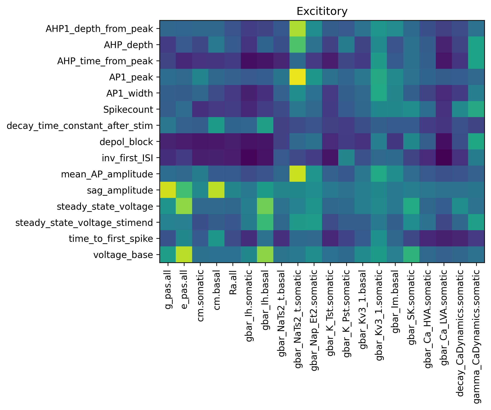

# human_cortical_single_neuron_models
Huamn cortical single cell simulation models for BMTK+neuron
- Bio-realistic: including representation of major ion channels
- All-active: Na and K channels on dendrites
- Ground with patch-seq experiments

Example:
simple_iclamp.py to simulate a single cell with square curent clamp

Enviroment requirement
- BMTK v1.1.1+
- neuron v8.+

firgures for analysis
Visualization of traces compare to experiments

training progress for the genetic optimization

SOBOL sensitivity analysis 

