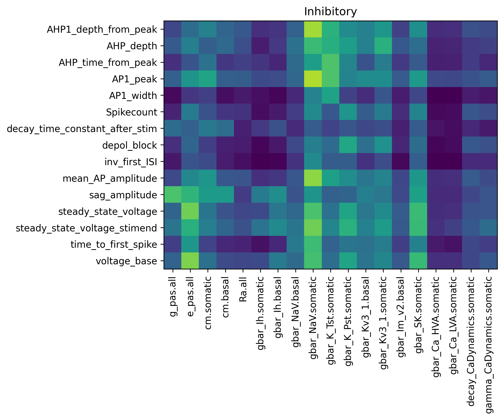

# human_cortical_single_neuron_models
Huamn cortical single cell simulation models for BMTK+neuron
- Bio-realistic: including representation of major ion channels
- All-active: Na and K channels on dendrites
- Ground with patch-seq experiments

Example:
simple_iclamp.py to simulate a single cell with square curent clamp

Enviroment requirement
- BMTK v1.1.1+
- neuron v8.+

firgures for analysis
Visualization of traces compare to experiments

code in /figure_traces/
Comparison of electrophysiology traces between simulation and source experiments. (Top row) Recorded traces from experiments showing responses to the highest and lowest square current clamps. (Middle row) Simulated traces generated using the same current clamp parameters. (Bottom row) Overlay of the first spike elicited by the highest current clamp, with simulated traces shown as solid lines and experimental traces as transparent lines, alongside the frequency-current (F/I) curve.  The color code is iT23, IT35, IT46, PV, SST, VIP, LAMP5 from the left.

training progress for the genetic optimization

code in /figure_training_history/
Optimization history of simulation parameters. (Top) Objective function values for the best model in each generation, where lower values indicate better performance. Cross marks denote the emergence of a new best model. (Bottom) Electrophysiological traces of the best models across generations, showing responses to all six square current clamps used during training

SOBOL sensitivity analysis 

code in /figure_sobol_analysis/
see Method Sensitivity Analysis of Model Parameters on Simulated Features.docx for details

Model v RNA seq

code in /figure_model_v_rna_seq/
Correlation of ion channel parameters with RNA sequencing data from the specific cell used for model training.

Model parameters UMAP

code in /figure_UMAP_parameters/

model vs experiment, ephys features

code in /figure_UMAP_ephys_features/

8 ephys features were used in this UMAP
     'AHP1_depth_from_peak',
     'AHP_time_from_peak',
     'AP1_width',
     'decay_time_constant_after_stim',
     'inv_first_ISI',
     'mean_AP_amplitude',
     'sag_amplitude',
features that tie to the base or envelope were not selected due to the models are not good at representing them. 

